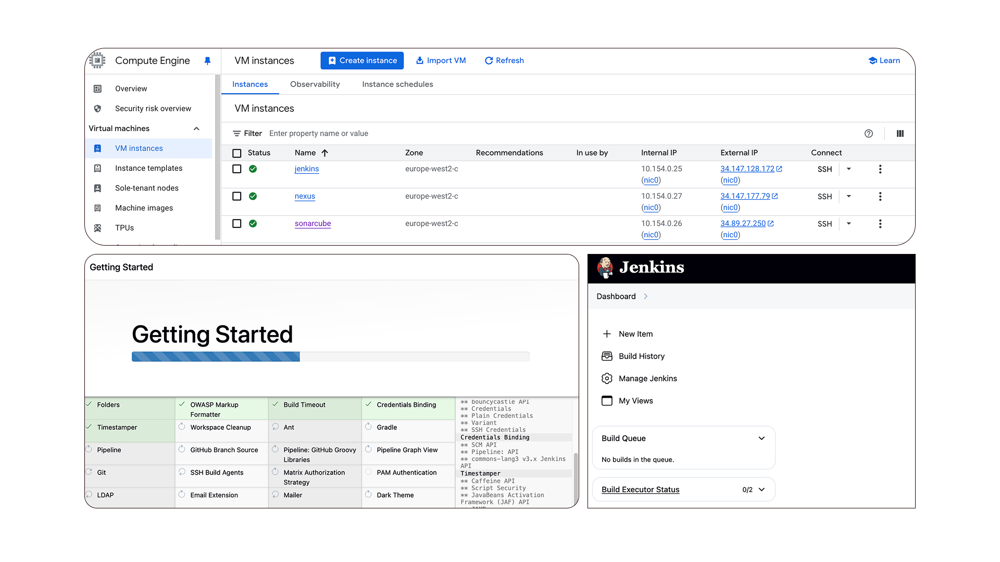

# DevSecOps-jenkins-sonarqube-nexus
Building a Scalable Jenkins Pipeline Integrated with SonarQube and Nexus for Version-Aware Artifact Management

#### Overview of this project
 - CI/CD Pipeline Setup: Integrated Jenkins, SonarQube, and Nexus for a seamless build and deployment pipeline and automated code quality checks using SonarQube and artifact management using Nexus.
 - Building Robust Pipelines: Automatically deploy code from GitHub to Jenkins, analyze it with SonarQube, and push the resulting artifacts to Nexus for version control.
 - Maven Integration: Managed artifact versions (SNAPSHOT vs. RELEASE) to avoid overwriting and ensure version discipline using Nexus.
 - SonarQube Setup: Configured SonarQube for static code analysis and enforced quality gates before production and ensured only quality-verified code reaches production environments.
 - Deploy to Nexus: Configure Nexus for storing development and production artifacts, maintaining traceability and version control. Pushed SNAPSHOT and RELEASE artifacts to different repositories for better management.
 - Practical Demo: demo of setting up Jenkins, configuring SonarQube for analysis, and deploying artifacts to Nexus. Walkthrough on version management, quality control, and deployment automation.

#### Problem Statement
In modern DevOps-driven environments, delivering high-quality, version-controlled software rapidly is crucial. Manual build, test, and release processes often lead to inconsistencies, security risks, and delayed deployments. To overcome this, organizations implement Continuous Integration and Continuous Delivery (CI/CD) pipelines that ensure automated builds, code quality checks, and artifact management.
 - Automated code quality analysis
 - Version-controlled artifact management
 - Seamless integration of developer workflows
 - Enforcement of proper version tagging for artifact traceability

#### Why need this
In the modern DevOps landscape, Continuous Integration and Continuous Delivery (CI/CD) are at the heart of delivering high-quality software faster. A properly configured CI/CD pipeline ensures.
 - Rapid feedback through code analysis
 - Automated build and testing
 - Reliable artifact publishing for version control

#### When need this
 - Your team is building Java-based applications with Maven.
 - There’s a need for a centralized code quality gate before releasing artifacts.
 - You want to version-control all builds, either as production releases or development snapshots.
 - Your organization is adopting DevSecOps practices and wants traceability in artifact flow.
 - You’re deploying across multiple environments (e.g., QA, UAT, Prod) and need consistent artifacts from a central repository (Nexus).

### Architecture Overview

## Step-by-Step Implementation 

### Prerequisites
3 Ubuntu servers (Ubuntu 24.04) each with: 2 CPUs, 8 GB RAM minimum. Open required ports: Jenkins (8080), SonarQube (9000), Nexus (8081). Internet access on all servers.

#### Jenkins server
```
sudo su
sudo apt update

sudo apt install openjdk-17-jre-headless -y
sudo apt install maven -y

java --version
mvn -v

sudo wget -O /usr/share/keyrings/jenkins-keyring.asc \
  https://pkg.jenkins.io/debian-stable/jenkins.io-2023.key


echo deb [signed-by=/usr/share/keyrings/jenkins-keyring.asc] \
  https://pkg.jenkins.io/debian-stable binary/ | sudo tee \
  /etc/apt/sources.list.d/jenkins.list > /dev/null


sudo apt-get update

sudo apt-get install jenkins -y

jenkins --version
```

